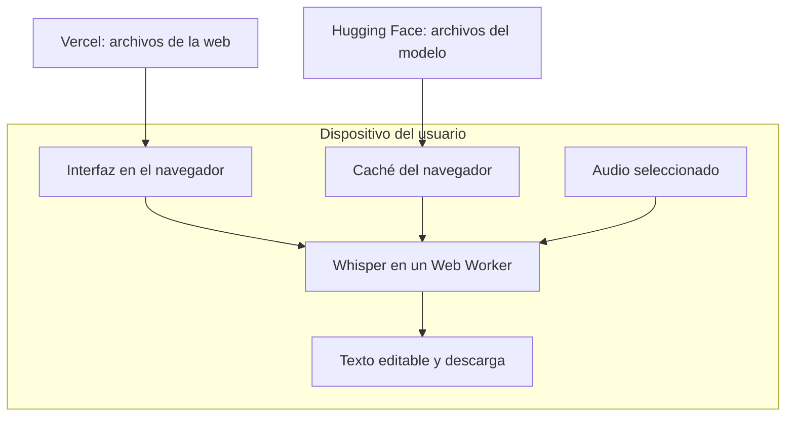

# Plan de implementación: transcriptor web con Whisper

Fecha: 27 de septiembre de 2026. Estado: Etapas 1, 2 y 3 implementadas en el primer prototipo funcional; validación con pruebas en navegador realizada.

## Objetivo y decisiones confirmadas

Crear una web gratuita y de código abierto para seleccionar un audio, transcribirlo, corregir el texto y descargarlo. Uso principal: audios cortos de forma diaria, con una experiencia accesible para una persona que no usa la terminal.

Decisiones confirmadas:

- Aplicación web con Whisper ejecutándose en el navegador de cada usuario.
- Presupuesto de alojamiento y transcripción: $0.
- Publicación de la interfaz en Vercel.
- El rendimiento puede depender de la computadora del usuario.
- Sin backend de transcripción remoto, servidor local en una laptop ni instalador.
- Código abierto y acceso gratuito para otras personas.
- Uso sin cuotas de minutos, número de transcripciones ni topes artificiales de tamaño o duración. Las duraciones usadas en las pruebas son muestras de validación, no restricciones del producto.
- Acceso al flujo principal sin cuenta, suscripción ni pago por desbloquear funciones.

Español como idioma inicial y computadoras como objetivo de validación son propuestas para la primera versión. El modelo, los formatos compatibles y la gestión de recursos se ajustarán mediante pruebas dentro de la arquitectura elegida. La capacidad real depende del dispositivo y del navegador; no se garantiza procesar cualquier archivo en cualquier equipo.

## Arquitectura elegida

Ejecutar Whisper en el navegador del usuario mediante Transformers.js. Publicar la interfaz como archivos estáticos en Vercel. El navegador descarga los archivos del modelo desde Hugging Face y realiza la transcripción en el dispositivo. Transformers.js ejecuta una conversión ONNX de Whisper; no requiere instalar Python ni ejecutar faster-whisper.

Transformers.js permite ejecutar modelos ONNX en el navegador mediante CPU/WASM o GPU/WebGPU. La compatibilidad y el rendimiento deben comprobarse con los equipos objetivo. [Documentación de Transformers.js](https://huggingface.co/docs/transformers.js/en/index), [guía WebGPU](https://huggingface.co/docs/transformers.js/guides/webgpu).

El audio y la transcripción permanecerán en el dispositivo. Habrá conexiones para descargar la aplicación y el modelo; la privacidad se comprobará inspeccionando las solicitudes de red.

Vercel distribuirá archivos estáticos; el proyecto no usará funciones de servidor para transcribir. La espera inicial será la descarga y preparación del modelo. Su caché evita repetir la descarga cuando se conserva; el motor puede necesitar inicializarse de nuevo al abrir otra sesión.

La publicación estática con Vite está soportada por Vercel. [Documentación de Vite en Vercel](https://vercel.com/docs/frameworks/frontend/vite).

## Tecnologías y decisiones iniciales

| Parte | Propuesta | Motivo |
| --- | --- | --- |
| Interfaz | React + TypeScript + Vite | Aplicación estática con componentes reutilizables |
| Inferencia | Transformers.js + Whisper convertido a ONNX | Ejecutar el modelo localmente |
| Modelos candidatos | `onnx-community/whisper-base` como candidato inicial; `onnx-community/whisper-tiny` como opción ligera | Elegir el predeterminado tras comprobar calidad y consumo en español |
| Ejecución | Web Worker; WebGPU cuando funcione, WASM como alternativa validada | Mantener la interfaz operativa durante el procesamiento |
| Preparación de audio | Web Audio API; conversión a mono y frecuencia requerida por el modelo | Adaptar archivos a la entrada del transcriptor |
| Persistencia inicial | Caché del modelo; texto en la sesión y descarga explícita | Evitar descargas repetidas y ofrecer guardado sencillo |
| Publicación | Vercel Hobby conectado al repositorio | Distribuir la compilación estática de Vite |
| Código abierto | Repositorio público y licencia MIT | Facilitar uso, contribuciones y alojamiento propio |

Usar modelos multilingües; las variantes `.en` están destinadas a inglés. Whisper publica código y pesos bajo licencia MIT. Se conservarán los avisos y se revisarán las licencias de las conversiones y dependencias concretas. [Repositorio oficial de Whisper](https://github.com/openai/whisper), [modelo base ONNX](https://huggingface.co/onnx-community/whisper-base).

Las versiones de paquetes, revisión del modelo y configuración de cuantización se fijarán tras el prototipo. No se copiará una configuración de precisión de otro modelo sin comprobar su compatibilidad.

## Primera versión pública

Flujo principal: abrir la web → seleccionar archivo → elegir idioma → pulsar «Transcribir» → descargar/preparar modelo si hace falta → transcribir → revisar texto → copiar o descargar.

- Selección y arrastre de un archivo a la vez.
- MP3 y WAV como formatos iniciales por validar; evaluar M4A por su utilidad para audios cotidianos y admitirlo en los navegadores donde la decodificación funcione.
- Español como valor inicial, con selector de idioma.
- Progreso diferenciado de descarga, preparación de audio y transcripción.
- Procesamiento por fragmentos con solapamiento y unión que evite duplicar texto en los límites.
- Cancelación, reintento y mensajes comprensibles para archivos dañados, falta de memoria y fallos de descarga.
- Resultado editable, reproducción del audio, copia y exportación TXT.
- Instrucción clara para mantener abierta la pestaña mientras se procesa.
- Uso por teclado, etiquetas accesibles y estados que no dependan solamente del color.
- Transcripciones repetidas sin contador de uso ni bloqueo por duración o tamaño arbitrarios; mensajes recuperables ante errores reales de memoria o decodificación.

La biblioteca documenta fragmentación y marcas de tiempo para Whisper. Habrá que validar la continuidad del texto y los subtítulos con el modelo seleccionado. [API de reconocimiento de voz](https://huggingface.co/docs/transformers.js/api/pipelines#module_pipelines.AutomaticSpeechRecognitionPipeline).

Las exportaciones SRT/VTT y el historial local son mejoras posteriores al flujo principal. La primera versión se concentra en transformar un archivo de audio en texto corregible y descargable.

## Etapas y criterios de salida

1. **Base y prototipo de transcripción.** Crear React + TypeScript + Vite e integrar un worker con Whisper. Comparar base y tiny multilingües con audios en español de 1, 3 y 10 minutos, incluyendo voz limpia, ruido y silencio; incluir también una grabación larga para evaluar memoria y continuidad. Registrar equipo, navegador, descarga inicial, tiempo de inferencia, memoria cuando sea medible y errores frente a transcripciones de referencia. Probar WebGPU y WASM por separado. Resultado: modelo predeterminado, navegadores compatibles y comportamiento documentado en los equipos probados. La velocidad se informa; no es necesario exigir tiempo real. Priorizar calidad útil, estabilidad e interfaz que responda.

2. **Motor de transcripción.** Implementar descarga con progreso, caché, preparación de audio, fragmentación, unión de resultados y cancelación. Procesar un archivo a la vez, liberar recursos al terminar y evitar que un trabajo cancelado actualice el resultado siguiente. Diseñar la decodificación de archivos largos para trabajar por partes cuando las herramientas y los formatos lo permitan; evaluar esta etapa además de la inferencia. Conservar resultados de fragmentos terminados cuando un fallo posterior permita recuperarlos. Resultado: un archivo admitido genera texto continuo sin duplicaciones en las uniones; cancelar detiene el trabajo y permite empezar otro, tantas veces como se necesite.

3. **Interfaz y exportación.** Construir una pantalla con selección de archivo, idioma, progreso, reproducción y texto editable. Mostrar estados reales: listo, descargando modelo, preparando audio, transcribiendo, terminado, cancelado y error. Presentar descarga y procesamiento por separado; usar porcentaje solo cuando se pueda medir. Copiar y exportar el texto corregido. Resultado: una persona completa el recorrido y obtiene un TXT; los fallos tienen una acción de recuperación.

4. **Validación de la versión publicable.** Comprobar navegadores objetivo, primera descarga y reutilización del modelo, archivos inválidos, falta de WebGPU, red interrumpida, cancelación y agotamiento de memoria. Verificar con las herramientas de red que no se transmiten audio ni texto. Comprobar edición, copia, TXT y uso por teclado. Repetir transcripciones para detectar fugas de memoria y confirmar que no existen cuotas artificiales. Automatizar comprobaciones útiles de unión de fragmentos/exportación y una prueba integral con audio breve; documentar las mediciones de rendimiento en equipo real.

5. **Publicación y documentación.** Preparar repositorio público, licencia, README para contribuidores, guía de contribución y política breve de datos. Configurar instalación reproducible, comprobación de tipos y compilación. Conectar Vercel Hobby con el repositorio, usar `npm run build` y publicar `dist` con subdominio `vercel.app`. Verificar desde una sesión nueva descarga de modelos, carga del worker y archivos del motor. Resultado: enlace público utilizable sin configuración técnica por parte del usuario, y procedimiento para que terceros publiquen su propia copia.

6. **Mejoras posteriores.** Añadir SRT/VTT con marcas de tiempo verificadas e historial local en IndexedDB con borrado explícito. Evaluar uso sin conexión cuando estén disponibles en caché la aplicación, el motor y el modelo. La aplicación seguirá siendo web. Evaluar audios más largos, celulares y modelos mayores con mediciones nuevas.

## Alojamiento y costos

Vercel Hobby ofrece un plan gratuito para proyectos personales sin fines comerciales, sujeto a cuotas. Usar el subdominio gratuito y verificar las condiciones vigentes al publicar. Este plan contempla el uso personal y gratuito descrito por el usuario. [Plan Hobby](https://vercel.com/docs/plans/hobby).

Los pesos del modelo se descargarán directamente desde un repositorio público de Hugging Face con revisión fijada, sin incluirlos en `dist`. Hugging Face servirá archivos; la inferencia ocurre en el navegador. La aplicación manejará errores y reintentos del proveedor, que aplica límites de solicitudes. Usar descargas públicas sin exponer credenciales en el frontend. [Límites del Hub](https://huggingface.co/docs/hub/rate-limits).

Presupuesto establecido: $0 de alojamiento web dentro del plan gratuito y $0 de API de transcripción. El cómputo lo aporta el dispositivo del usuario. Las cuotas o caídas de los proveedores se comunicarán como errores recuperables; la arquitectura no depende de mantener un proceso remoto de Whisper encendido.

## Aspectos que resolver dentro de esta arquitectura

- **Descarga inicial:** mostrar su tamaño real antes de iniciarla. El caché puede ser eliminado por el navegador; una descarga anterior no garantiza disponibilidad futura.
- **Audio largo:** fragmentar la inferencia no resuelve por sí solo la memoria de decodificación. `decodeAudioData()` trabaja con el archivo completo. Evaluar decodificación incremental y liberación de buffers para reducir el consumo. Si el equipo no puede procesar un archivo, explicar el fallo y permitir reintentar o recuperar texto parcial; no introducir un tope comercial de duración. [Documentación de Web Audio](https://developer.mozilla.org/en-US/docs/Web/API/BaseAudioContext/decodeAudioData).
- **Potencia y batería:** la calidad y velocidad deberán evaluarse por modelo y equipo. El soporte de celulares queda condicionado a esas pruebas.
- **Cierre o suspensión:** un worker no garantiza continuar con la pestaña cerrada o el dispositivo suspendido. Indicar que se mantenga la página abierta hasta terminar y ofrecer descarga del texto antes de salir.
- **Calidad:** permitir revisar y corregir resultados; incluir silencios y ruido en la evaluación para detectar texto espurio y repeticiones.
- **Uso sin conexión:** requiere almacenar todas las dependencias, además del modelo, y comprobar cuotas y eliminación del caché. [Caché en aplicaciones web](https://developer.mozilla.org/en-US/docs/Web/Progressive_web_apps/Guides/Caching).

## Entrega de la primera versión

La primera versión estará completa cuando una persona pueda abrir el enlace público, seleccionar un audio admitido, transcribirlo en su navegador, corregir el resultado y descargarlo, y repetir el proceso sin cuotas ni pagos; el recorrido deberá funcionar sin terminal ni configuración técnica, y el repositorio permitirá reproducir la aplicación con instrucciones documentadas.
