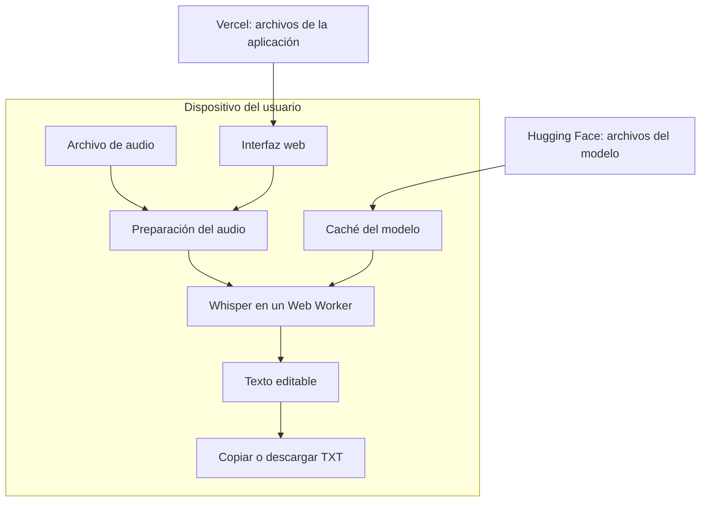

# Arquitectura

**Estado:** arquitectura implementada en el primer prototipo y validada con pruebas en navegador.

## Distribución del trabajo

Vercel entregará la aplicación como archivos estáticos. El navegador descargará el modelo desde Hugging Face y ejecutará Whisper mediante Transformers.js. El audio se seleccionará y procesará en el dispositivo del usuario.

## Componentes previstos

| Componente | Responsabilidad |
| --- | --- |
| Interfaz con React | Selección del archivo, idioma, controles, estado y edición |
| Preparación de audio | Decodificación, conversión a la entrada del modelo y gestión de fragmentos |
| Worker de transcripción | Carga del motor, ejecución de Whisper y comunicación de resultados |
| Gestión del modelo | Descarga con progreso, caché y recuperación de errores |
| Exportación | Copia y generación del TXT a partir del texto corregido |

Un Web Worker ejecuta trabajo separado del hilo principal de la página. Se utilizará para que los controles sigan respondiendo mientras se transcribe.

## Modelo y motor

Transformers.js permite ejecutar modelos ONNX en el navegador. WebGPU permite utilizar una GPU compatible; WebAssembly ofrece una vía de ejecución mediante CPU. Se comprobará cada combinación de modelo, configuración y motor antes de ofrecerla. [Documentación de Transformers.js](https://huggingface.co/docs/transformers.js/en/index).

Whisper `base` multilingüe es el candidato inicial y `tiny` multilingüe la opción ligera a evaluar. Las variantes con sufijo `.en` están orientadas a inglés. La selección definitiva considerará calidad en español, descarga y consumo de recursos. [Modelos de Whisper](https://github.com/openai/whisper).

Se fijarán las versiones de las dependencias y la revisión del modelo para que las instalaciones puedan reproducirse. El formato y la precisión numérica del modelo se elegirán con el prototipo.

## Recorrido de una transcripción

1. Leer el archivo elegido y comprobar que puede decodificarse.
2. Obtener el modelo desde la caché o descargarlo.
3. Preparar el motor y el audio.
4. Procesar fragmentos, comunicar avances y unir el texto sin duplicar palabras en los solapamientos.
5. Entregar el resultado al editor.
6. Liberar buffers y recursos que ya no se necesiten.

La cancelación deberá detener el trabajo y evitar que resultados tardíos sobrescriban una transcripción nueva. El progreso de descarga y el de transcripción se comunicarán por separado.

## Gestión de recursos

Se procesará un archivo a la vez. No habrá contadores de consumo ni bloqueos por cuotas de minutos o transcripciones.

Procesar la inferencia por fragmentos no resuelve automáticamente el consumo de memoria al decodificar el archivo. La API `decodeAudioData()` necesita los datos completos del archivo; se evaluarán alternativas de decodificación incremental para grabaciones largas. [Referencia de Web Audio](https://developer.mozilla.org/en-US/docs/Web/API/BaseAudioContext/decodeAudioData).

Ante falta de memoria o errores del motor, la aplicación deberá permitir reintentar y recuperar los fragmentos terminados cuando sea posible. Los fallos técnicos se documentarán junto con las combinaciones de equipos y navegadores comprobadas.

## Decisiones pendientes del prototipo

- Modelo predeterminado y configuración de precisión.
- Navegadores y formatos comprobados.
- Estrategia de decodificación de archivos largos.
- Tamaño efectivo de descarga y comportamiento de la caché.
- Calidad de la transcripción en español y consumo de recursos medido.

Las etapas completas están en el [plan de implementación](../PLAN_IMPLEMENTACION.md).
